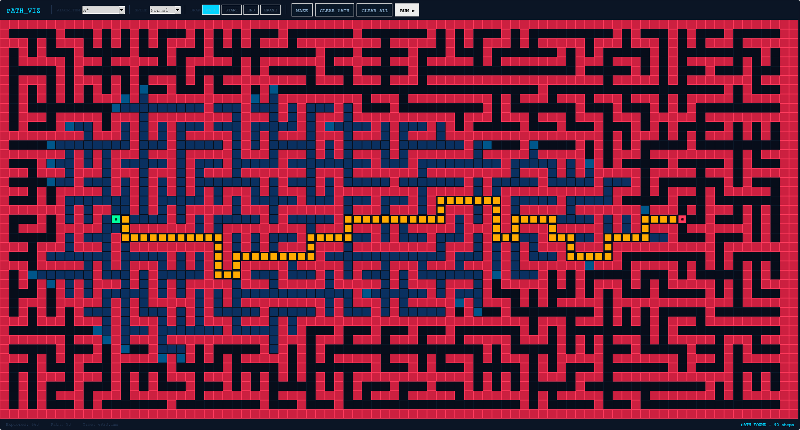
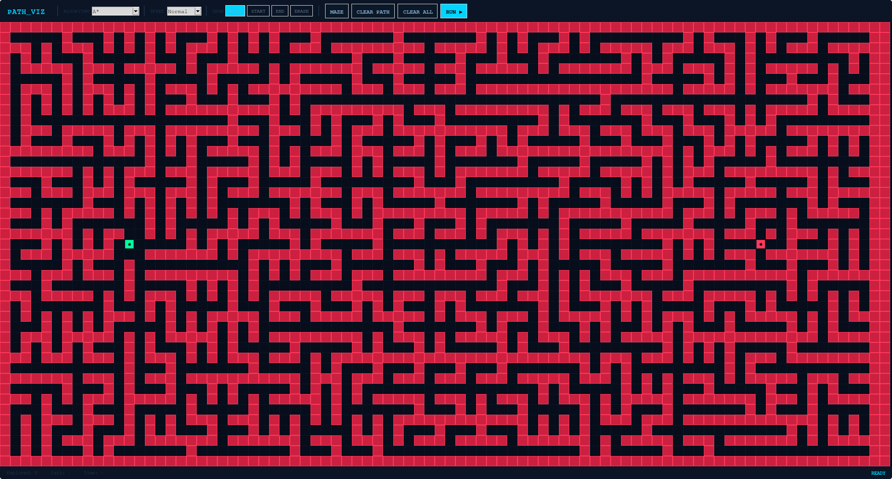

# Pathfinding Visualiser

An interactive pathfinding visualiser built in Python with tkinter. Draw walls, place start and end points, generate mazes, and watch 5 different algorithms explore the grid in real time.



---

## Algorithms

| Algorithm | Shortest path | Strategy |
|-----------|:---:|---------|
| **A\*** | ✓ | Manhattan-distance heuristic guides the search — fastest to the goal in practice |
| **Dijkstra** | ✓ | Explores by cumulative cost, expanding outward uniformly |
| **BFS** | ✓ | Level-by-level wave expansion — optimal on unweighted grids |
| **DFS** | ✗ | Follows a single path as deep as possible before backtracking |
| **Greedy Best-First** | ✗ | Heuristic-only — rushes toward the goal but can miss the shortest route |

---

## Screenshots

| Drawing walls | Path found |
|---------------|------------|
|  |  |

---

## Colour key

| Colour | Meaning |
|--------|---------|
| 🟢 Green | Start |
| 🔴 Red | End |
| ⬛ Dark red | Wall |
| 🔵 Dark blue | Explored |
| 🟦 Mid blue | Frontier |
| 🟡 Amber | Shortest path |

---

## Requirements

- Python 3.8+
- tkinter (included with most Python distributions)

```bash
# Linux — if tkinter is missing
sudo apt install python3-tk       # Debian / Ubuntu
sudo dnf install python3-tkinter  # Fedora
```

---

## Running

```bash
python pathfinding_visualiser.py
```

---

## Controls

| Input | Action |
|-------|--------|
| Left-click / drag | Draw with the selected tool |
| Right-click / drag | Erase |
| **WALL** tool | Place walls |
| **START** tool | Move the start point |
| **END** tool | Move the end point |
| **ERASE** tool | Remove walls or path cells |
| **MAZE** | Generate a random maze using Randomised Prim's algorithm |
| **CLEAR PATH** | Remove explored and path cells, keep walls |
| **CLEAR ALL** | Reset the entire grid |
| **RUN ▶** | Run the selected algorithm |
| Speed dropdown | Control animation speed (Slow / Normal / Fast / Instant) |

---

## Maze generation

Mazes are generated with **Randomised Prim's algorithm**, which grows a spanning tree outward from the start cell by repeatedly carving passages into unvisited cells. Because the result is a spanning tree, every cell is reachable from every other cell by exactly one path — the maze is always solvable.

---

## License

MIT
